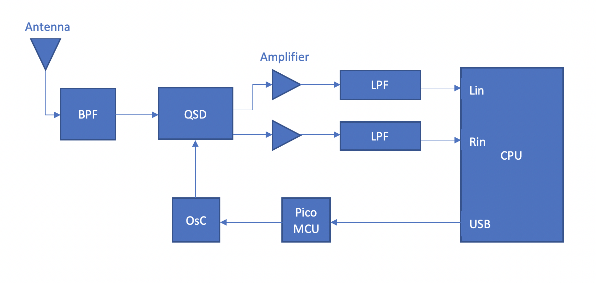

# Short-Wave-Software-Defined-Receiver
The goal of this project has been to design a Software Defined Radio Receiver with [Taylor Smith](https://github.com/TaylorSmith28) for the Engineering Electronics II class.
## Design Objectives
For this project we were given the following design objectives by [Dr. Rob Frohne](https://github.com/frohro):

#### Objectives
 - Low noise figure
 - Good image rejection
 - Minimum discernible signal of less than 1uV
 - $25 Budget

For specifications we originally were going to have a narrow bandpass filter, but ended up switching to a relatively wider one in the later stages of the project.

#### Specifications
 - Frequency Range of 7-12MHz
 - Short Wave Radio
 - Uses a Tayloe Mixer
 - Uses a Multiple Feedback Lowpass Filter and Amplifier
 	- 25 V/V gain with Cutoff Frequency of more than 50KHz
 - Butterworth Bandpass Filter
 - Uses the Raspberry Pi Pico
 
 ## Overview
 The SDR receiver connects to an antenna and filters, mixes, and amplifies that signal to achieve the desired I and Q signals. The I and Q signals are then sent through an external sound card with a sample rate of 48kHz where software then handles the demodulation of the signal into audio. The mixer requires a 90 degree offset of two clocks operating at a frequency that can be controlled through software. In our design we use a Raspberry Pi Pico to control an si5351 to supply those two 90 degree offset clocks. There were some significant issues with this since the code supplied by professor Frohne didn't work when ported over to the Raspberry Pi Pico. In theory though the Raspberry Pi Pico interfaces with Quisk to tune to a certain frequency by adjusting the frequency of the si5351 clocks.
 
 ## Theory

 
 

 
